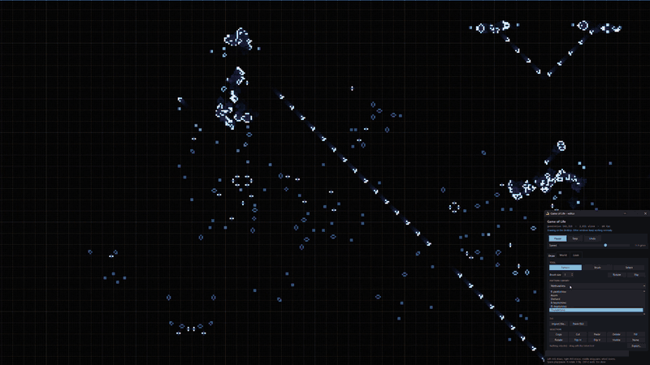

<p align="center">
  
</p>

<p align="center">
  <a href="LICENSE"></a>
  
  
  
  <a href="https://github.com/ghbanck/GameOfLife-Wallpaper/actions/workflows/ci.yml"></a>
</p>

<p align="center">
  <b>English</b> · <a href="docs/README.pt-BR.md">Português (Brasil)</a>
</p>

Conway's Game of Life running as a live Windows wallpaper — **behind your desktop icons**,
never covering an application, and **interactive only when you want it to be**.

<p align="center">
  
  <br>
  <sub>▶ Full 58-second demo: <a href="docs/media/demo.mp4">demo.mp4</a></sub>
</p>

## Features

- **A real wallpaper.** It lives where the wallpaper lives: icons stay on top and clickable,
  and every other window, the taskbar and the Start menu keep working normally.
- **Draw on your desktop.** `Ctrl+Alt+Shift+G` (or a click on the tray icon) toggles
  *draw mode*: clicks on the desktop paint cells, clicks anywhere else go where they always did.
- **GPU-rendered.** Direct3D 11 + DirectComposition: ~2–3% of one core at 30 fps in 4K,
  ~35–70 MB of memory.
- **Rests when nobody can see it.** Desktop covered by windows, full-screen game, locked
  session, display off, battery saver, Remote Desktop — it pauses on its own.
- **Pure Life.** The world only changes through the rule or your edits; nothing is injected
  behind your back, so a hand-built pattern runs exactly as it should. The world is saved and
  resumes where it left off after a reboot.
- **~4,800-pattern library** — the whole Life Lexicon plus the LifeWiki pattern collection —
  each with an icon, name search and a hover card: the pattern animated, its measured period,
  speed and lifespan, who found it and a short description.
- **Saved worlds**, including three showcases: the famous **digital clock** built in Life,
  an **oscillator garden** and a **spaceship parade**.
- **Imports** RLE, `.cells` and Life 1.06 (patterns copied from LifeWiki paste straight in).
- **Eight palettes** (matrix, ember, ice, mono, synthwave, bio, solar, deepsea), age-based
  colouring, fading trails, a multi-level grid and alternative rules (HighLife, Day & Night,
  Seeds…).
- **English and Portuguese** UI, following the Windows language.

## Installation

**Requirements:** Windows 10 or 11. Python 3.10+ is only needed to build from source.

### Download

Grab `GameOfLifeWallpaper.exe` from the
[latest release](https://github.com/ghbanck/GameOfLife-Wallpaper/releases/latest) and run it.
It is a single portable file: `config.json`, the log and the saved world are written next to it
(or to `%APPDATA%\golwall` if that folder is not writable). Nothing else is installed.

### Build from source

```powershell
git clone https://github.com/ghbanck/GameOfLife-Wallpaper.git
cd GameOfLife-Wallpaper
python scripts/build.py
```

The script creates a virtual environment, installs `numpy` and `pyinstaller`, runs the test
suite, builds `dist\GameOfLifeWallpaper.exe`, smoke-tests the executable and then offers to
**start with Windows** (an `HKCU\...\Run` entry you can turn off from the tray menu) and to
**open it now**. Run it again after editing the code: it closes the running copy, keeps
`dist\config.json` and the saved world, and replaces only the `.exe`.

No Windows settings need changing — the program places itself behind the icons.

### Uninstall

1. Tray menu → untick **Start with Windows** → **Exit**.
2. Delete the folder. Nothing else was written to the system.

## Usage

| Action | How |
|---|---|
| Toggle draw mode | `Ctrl+Alt+Shift+G` or left-click the tray icon |
| Menu (pause, new soup, palette, worlds, hide, start with Windows, exit) | right-click the tray icon |
| Launch the executable again | opens the editor of the copy already running |

**In draw mode**, over the desktop:

| Mouse | Effect |
|---|---|
| Left click | stamp the pattern / paint with the brush / select |
| Right click | erase (or cancel what is being moved) |
| Middle-drag | pan (the world has no edges: it is a torus) |
| Wheel | zoom at the cursor; zooming out past the world size tiles it, down to 1/4 — **Fit** returns to the whole world |

With the panel focused: `Space` run/pause · `R` rotate · `F` flip · `P`/`B`/`S` pattern,
brush, select · `1`–`9` pick a pattern from the list · `Ctrl+C/X/V` copy, cut, paste (as RLE
text on the clipboard) · `Ctrl+Z` undo · `Del` delete selection · `Esc` done.

The panel has three tabs: **Draw** (tools, pattern library, RLE import, selection),
**World** (saved worlds, clear, new soup, skip ahead N generations, rule) and **Look** (zoom,
palette, trails, grid, start with Windows, save the current settings as defaults).

### Pattern library

- **Categories:** favourites, still lifes, oscillators, spaceships, guns, puffers & rakes,
  methuselahs, fuses & agars, reflectors/eaters/circuitry, glider syntheses, large
  constructions, other — and **My patterns**.
- **Search:** any part of the name, words in any order (`glider gun`, `p46`, `snark`).
- **Hover card:** the pattern animated (an oscillator cycles through its period, a spaceship
  flies in place, a gun fires), type, period, speed, size, discoverer and year, and a short
  description.
- **Open as world:** patterns larger than the world (computers, replicators, displays) resize
  the world to fit, with room around them.
- **My patterns:** **My folder** opens `patterns\` next to the executable; `.rle`, `.cells` and
  `.lif` files dropped there appear after **Refresh**. **Save to My patterns** stores the
  current selection.

Every period, speed and lifespan on a card was *measured*: the build script runs each pattern
until it repeats, dies or grows.

### Worlds

The **World** tab and the tray's **Worlds** menu list your saved worlds (in `worlds\` next to
the executable) and three examples. **Save** stores the current world under a name — size,
camera and speed included. The files are plain RLE and open in Golly or any other Life program.

- **Digital clock** — the seven-segment clock from the Code Golf Stack Exchange challenge
  *"Build a digital clock in Conway's Game of Life"* (by "dim", 2017), in Vladan Majerech's
  reduced *clockMini* version. A minute ticks every 2,880 generations, so at 48 gen/s (the
  speed it opens at) it keeps real time while on screen. It is 7680 × 7946 cells; the engine
  splits the world into bands across threads at ~3 ms per generation.
- **Oscillator garden** — dozens of oscillators from the Lexicon and LifeWiki, each in its own
  plot. Nothing ever touches: it runs forever.
- **Spaceship parade** — twelve lanes of orthogonal spaceships at seven different speeds,
  wrapping around the torus. One species per lane, lanes apart: no collisions, ever.

## Configuration

`config.json` sits next to the executable (or in `%APPDATA%\golwall`). Invalid values become
a warning in the log and the default — never a crash. Changes apply on restart; **no rebuild
needed**. `GameOfLifeWallpaper.exe --write-config` writes a fresh file with every option.

| Key | Default | What it does |
|---|---|---|
| `world_width`, `world_height` | 1280, 720 | world size in cells (width rounded to a multiple of 64) |
| `rule` | `B3/S23` | rule in B/S notation |
| `density`, `warmup_generations` | 0.16, 400 | how a new soup is seeded and pre-run |
| `generations_per_second` | 8 | simulation speed |
| `fps` / `battery_fps` | 30 / 12 | frame rate (the editor uses 60) |
| `zoom` | 0 | pixels per cell; 0 fits the whole world on screen |
| `palette`, `cycle_palettes`, `cycle_minutes` | matrix, true, 20 | colours and automatic rotation |
| `trail_seconds`, `age_span` | 1.6, 20 | dead-cell trails; generations until the mature colour |
| `grid`, `grid_levels`, `grid_opacity` | true, [1, 8, 64], 0.15 | multi-level grid |
| `smooth` | false | smooth between cells instead of crisp squares |
| `pause_when_busy` / `pause_when_hidden` | true / true | rest with a full-screen app / with the desktop covered |
| `pause_on_battery_saver` / `pause_in_remote_session` | true / true | rest on battery saver / over Remote Desktop |
| `restore_world` | true | resume the last session's world |
| `attach_mode` | `auto` | `auto`, `progman` (Windows 11 24H2+ layout), `workerw` (classic layout) or `bottom` (bottom-most window; covers the icons but clicks reach them) |
| `hotkey`, `hotkey_fallbacks` | `ctrl+alt+shift+G`, … | editor shortcut, and alternatives if it is taken |
| `editor_frame` | true | coloured outline on the screens while drawing |
| `language` | `auto` | `auto` follows Windows; `en` or `pt` |

## Command line

```
GameOfLifeWallpaper.exe [options]        (or: venv\Scripts\python main.py [options])

  -w, --windowed        run in a normal window instead of on the desktop
  --editor              open the editor on start
  --attach MODE         force auto | progman | workerw | bottom
  --diagnose            print what the program would do on this desktop and exit
  --install-startup     enable "start with Windows" and exit (--uninstall-startup disables it)
  --seconds N           exit after N seconds (quick test)
  --world WxH, --zoom N, --palette NAME, --config FILE, --log-file FILE, --no-tray
  --list-worlds, --open-world NAME     list saved worlds / start with one
  --list-palettes, --list-patterns [--search WORDS], --write-config, --version
```

## Troubleshooting

- **Log:** `golwall.log` next to the executable (tray menu → *Open the log*). It is rotated, not
  overwritten, so the run that misbehaved is still there.
- **Hard crash** (native fault): a traceback of every thread goes to `golwall.crash.log`.
- **`--diagnose`:** detected desktop layer, GPU, monitors, occlusion.
- **The wallpaper does not appear:** run `--diagnose`. If another animated-wallpaper program
  is open (Wallpaper Engine, Lively), close it — both compete for the same spot. As a last
  resort, `"attach_mode": "bottom"` always shows (covering the icons, with clicks still
  reaching them).
- **The desktop turned black after closing:** on Windows 11 24H2, asking Explorer for an
  animated-wallpaper layer creates an empty (black) surface above the Windows wallpaper that
  outlives the request. The program hides it on start, on hide and on exit — even after a
  crash — so your Windows wallpaper always comes back.
- **The hotkey does nothing:** another program registered it first; the log says which
  fallback was used (or use the tray icon). Change `hotkey` in `config.json`.

## How it works

- **Where it lives.** On Windows 11 24H2+, `Progman` holds the icon view (`SHELLDLL_DefView`)
  and, below it, a `WorkerW` that paints the wallpaper; the program creates a child window of
  `Progman` exactly between the two. On the classic layout (Windows 10 and earlier 11 builds)
  it becomes a child of the `WorkerW` behind the icons. Because `Progman` has no redirection
  surface, the window gets its own through DirectComposition. A probe checks the real pixels
  on screen (a near-black marker in sparse squares for 2 frames — invisible in practice).
- **Simulation.** One bit per cell, 64 cells per operation (~0.25 ms per generation on a
  1280×720 world); rules are compiled to a minimal boolean program. Large worlds are split
  into bands across threads.
- **Rendering.** Only the cells go to the GPU, and only when they change; cell age
  (birth → mature → old colour), trails, the grid, editor highlights and the draw-mode outline
  are computed in shaders.
- **Threads.** The main thread owns the world, the GPU, the desktop, the tray and the hotkey,
  sleeping until the next event (high-resolution timer + messages). The Tk panel runs on **its
  own thread**. The draw-mode mouse hook runs on a dedicated thread that does nothing else, and
  only exists while the editor is open.
- **Resilience.** Explorer restarts, monitor/resolution changes, GPU device loss (driver
  update, sleep) and desktop re-ordering are detected and recovered from automatically.

## Development

```powershell
python scripts\setup_dev.py         # venv + numpy + tests, no build
venv\Scripts\python main.py -w       # in a window, logging to the terminal
venv\Scripts\pythonw main.py         # as the wallpaper, no console
venv\Scripts\python tests\test_wallpaper.py   # 150+ checks, including the GPU against a CPU reference
```

```
golwall/
  app.py              scheduler: main loop, state, commands
  core/               simulation (bit-packed), patterns, library, RLE, palettes, camera, grid
  render/             Direct3D 11 renderer + HLSL shaders
  native/             Win32 / COM / D3D11 / DirectComposition bindings (ctypes)
  capabilities/       where to live (host), mouse (input), power/occlusion, persistence, worlds
  ui/                 editor, panel (Tk on its own thread), library, tray, theme, PT/EN strings
  data/               library.bin (the built library) and worlds/ (the example worlds)
sources/              library inputs: Lexicon, LifeWiki collection, clockMini, descriptions
tests/                test_wallpaper.py (runs everything), test_engine.py, test_zoom.py
scripts/              build.py (the executable), setup_dev.py (a dev environment)
packaging/            PyInstaller spec
tools/                build_library.py, make_worlds.py (--check), check_descriptions.py, make_hero.py
docs/                 Portuguese README and README media
main.py               entry point for the sources and the executable
```

To rebuild the library after changing `sources/`:

```powershell
venv\Scripts\python tools\build_library.py        # ~20 s (simulation results are cached)
venv\Scripts\python tools\make_worlds.py --check  # the example worlds, proving they last
```

Contributions are welcome — see [CONTRIBUTING.md](.github/CONTRIBUTING.md).

## Credits

- **Life Lexicon** by Stephen A. Silver and contributors,
  [CC BY-SA 3.0](https://creativecommons.org/licenses/by-sa/3.0/) — patterns, names and facts
  in the library; read from [playgameoflife.com/lexicon](https://playgameoflife.com/lexicon).
- **[LifeWiki](https://conwaylife.com/wiki/) pattern collection**
  (conwaylife.com/patterns/all.zip).
- **Digital clock:** [clockMini](https://github.com/VladanMajerech/ConwayLifeDigitalClocks) by
  Vladan Majerech, based on the clock by "dim" in the
  [Code Golf challenge](https://codegolf.stackexchange.com/questions/88783/build-a-digital-clock-in-conways-game-of-life).
- The library's short descriptions were written for this project from the facts in those sources.

See [THIRD_PARTY_NOTICES.md](THIRD_PARTY_NOTICES.md) for the licensing of bundled data.

## License

The source code is released under the [MIT License](LICENSE). Bundled pattern data keeps its
original licences — see [THIRD_PARTY_NOTICES.md](THIRD_PARTY_NOTICES.md).
