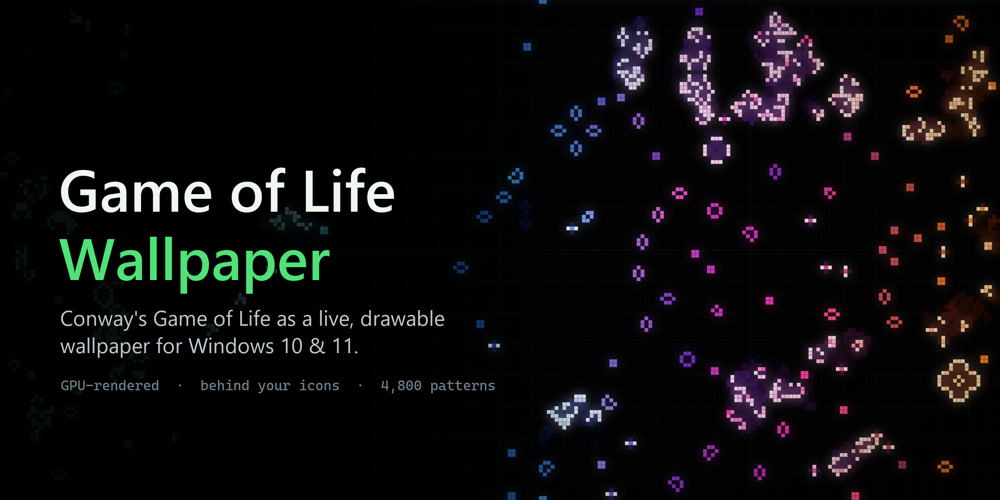
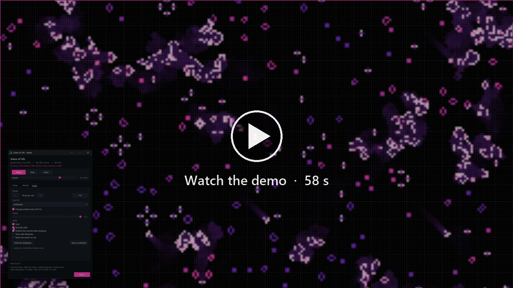

<p align="center">
  
</p>

<p align="center">
  <a href="../README.md">English</a> · <b>Português (Brasil)</b>
</p>

# Game of Life Wallpaper

O Jogo da Vida de Conway como papel de parede vivo do Windows 10/11 — **atrás dos ícones
da área de trabalho**, sem cobrir nenhum aplicativo, e **interativo só quando você quiser**.

- Fica no lugar do papel de parede: os ícones continuam por cima e clicáveis.
- `Ctrl+Alt+Shift+G` (ou um clique no ícone da bandeja) liga o **modo desenho**: cliques
  na área de trabalho desenham células; cliques em qualquer outra janela, na barra de
  tarefas ou no Menu Iniciar continuam funcionando normalmente.
- Renderizado na GPU (Direct3D 11 + DirectComposition): ~2–3% de um núcleo a 30 fps em 4K,
  ~35–70 MB de memória.
- Descansa sozinho quando ninguém consegue vê-lo: área de trabalho coberta por janelas,
  jogo em tela cheia, sessão bloqueada, tela apagada, economia de bateria, Área de Trabalho Remota.
- Vida pura: o mundo só muda pela regra ou pelas suas edições — nada é injetado sozinho, então
  um padrão montado à mão roda exatamente como deveria. Quando uma sopa se acalmar em "cinzas",
  use **Nova sopa** (bandeja ou painel). O mundo é salvo e continua de onde parou depois de
  reiniciar o PC.
- **Biblioteca com ~4.800 padrões** — o Life Lexicon inteiro e a coleção de padrões da LifeWiki —
  cada um com ícone, busca por nome e uma ficha ao passar o mouse: o padrão animado, o que é
  (período, velocidade, tempo de vida), quem descobriu e uma descrição curta.
- **Mundos salvos** numa lista, com três exemplos: o famoso **relógio digital** feito no Jogo da
  Vida, um **jardim de osciladores** e um **desfile de naves**.
- Importa padrões RLE / `.cells` / Life 1.06 (os da LifeWiki funcionam colando direto).

<p align="center">
  <a href="media/demo.mp4"></a>
</p>

---

## Instalação

Requisitos: Windows 10 ou 11. Python 3.10+ só é necessário para compilar.

**Pronto para usar:** baixe `GameOfLifeWallpaper.exe` na
[última versão](https://github.com/ghbanck/GameOfLife-Wallpaper/releases/latest) e execute. É um
arquivo único e portátil; `config.json`, log e o mundo salvo ficam ao lado dele.

**Compilar a partir do código:**

```powershell
git clone https://github.com/ghbanck/GameOfLife-Wallpaper.git
cd GameOfLife-Wallpaper
python scripts/build.py
```

O script cria o ambiente virtual, instala `numpy` e `pyinstaller`, roda os testes,
gera `dist\GameOfLifeWallpaper.exe`, testa o executável e oferece:

- **Iniciar com o Windows** (grava em `HKCU\...\Run`; dá para desligar no menu da bandeja);
- **Abrir agora**.

Não é preciso configurar nada nas Configurações do Windows: o programa se coloca sozinho
atrás dos ícones. Para rodar direto dos fontes, sem compilar, veja *Desenvolvimento*.

## Uso

| Ação | Como |
|---|---|
| Abrir/fechar o modo desenho | `Ctrl+Alt+Shift+G` ou clique no ícone da bandeja |
| Menu (pausar, sopa nova, paleta, ocultar, iniciar com o Windows, sair) | clique direito no ícone da bandeja |
| Rodar o executável de novo | abre o editor da cópia que já está rodando |

**No modo desenho**, sobre a área de trabalho:

| Mouse | Efeito |
|---|---|
| Clique esquerdo | carimba o padrão / desenha com o pincel / seleciona |
| Clique direito | apaga (ou cancela o que está sendo movido) |
| Arrastar com o botão do meio | move a vista (o mundo não tem bordas: é um toro) |
| Roda | zoom no ponto do cursor; afastando além do tamanho do mundo ele aparece repetido (é um toro), até 1/4 — **Encaixar** volta ao mundo inteiro, uma vez só |

Com o painel em foco: `Espaço` roda/pausa · `R` gira · `F` espelha · `P`/`B`/`S` padrão,
pincel, seleção · `1`–`9` escolhe um padrão da lista · `Ctrl+C/X/V` copiar, recortar, colar
(o texto vai para a área de transferência como RLE) · `Ctrl+Z` desfaz · `Del` apaga a seleção ·
`Esc` conclui.

O painel tem três abas: **Desenhar** (ferramentas, biblioteca de padrões, importar RLE,
seleção), **Mundo** (mundos salvos, limpar, sopa nova, avançar N gerações, regra — Conway,
HighLife, Day & Night, Seeds… —) e **Visual** (zoom, paleta, rastros, grade, iniciar com o
Windows, salvar as configurações atuais como padrão).

### A biblioteca de padrões

- **Categorias**: favoritos, vidas estáticas, osciladores, naves, canhões, puffers e rastelos,
  matusaléns, pavios e ágares, refletores/comedores/circuitos, sínteses com planadores,
  construções grandes, outros — e **Meus padrões**.
- **Busca**: digite parte do nome (qualquer ordem de palavras: `glider gun`, `p46`, `snark`).
- **Ficha ao passar o mouse**: o padrão animado (um oscilador passa pelo seu período, uma nave
  voa parada, um canhão dispara), tipo, período, velocidade, tamanho, quem descobriu e quando,
  e uma descrição curta em português (ou inglês, se o Windows estiver em inglês).
- **Abrir como mundo**: para padrões maiores que o mundo (computadores, replicadores,
  displays), o mundo passa a ter o tamanho do padrão, com espaço em volta.
- **Meus padrões**: **Minha pasta** abre `patterns\` ao lado do executável; os `.rle`, `.cells`,
  `.lif` que você colocar ali aparecem na categoria depois de **Atualizar**. **Guardar em Meus
  padrões** (na seção Seleção) salva a seleção atual lá.

Tudo o que a ficha diz sobre período, velocidade e tempo de vida foi *medido*: o script que
monta a biblioteca roda cada padrão até ele se repetir, morrer ou crescer.

### Mundos

Na aba **Mundo**, a lista traz os mundos salvos (em `worlds\` ao lado do executável) e os três
exemplos; o menu da bandeja tem a mesma lista em **Mundos**. **Salvar** guarda o mundo atual
com o nome digitado — tamanho, posição da câmera e velocidade incluídos. Os arquivos são RLE
comuns: abrem no Golly e em qualquer outro programa do Jogo da Vida.

- **Relógio digital** — o relógio de sete segmentos criado para o desafio *"Build a digital
  clock in Conway's Game of Life"* do Code Golf Stack Exchange (projeto de "dim", 2017), na
  versão reduzida *clockMini* de Vladan Majerech. Mostra horas e minutos (o rótulo "AM" desta
  versão não muda: continua AM depois do meio-dia, conferido simulando de 11:46 até 1:09); o minuto
  avança a cada 2.880 gerações, então a 48 ger/s (a velocidade com que ele abre) ele anda no
  ritmo de um relógio de verdade enquanto está na tela. Ele começa em 11:46, a hora gravada no padrão, e não dá para
  acertá-lo: a hora é o estado de um contador feito de células, e quando o papel de parede
  descansa (janelas por cima, tela bloqueada) o relógio para junto. São 7680 × 7946 células;
  o zoom vai abaixo de 1 pixel por célula para caber na tela (2 células por pixel em 4K,
  4 em Full HD); em telas que não são 16:9 ele enquadra só os dígitos.
  O motor divide o mundo em faixas e usa várias threads: ~3 ms por geração neste tamanho.
- **Jardim de osciladores** — dezenas de osciladores do Lexicon e da LifeWiki, cada um no seu
  canto, sob um título escrito com blocos. Nada nunca se toca: roda para sempre.
- **Desfile de naves** — doze pistas de naves ortogonais em sete velocidades diferentes, indo e
  voltando pelo toro. Uma espécie por pista, pistas afastadas: nenhuma colisão, nunca.

Um mundo carregado continua sendo ele mesmo depois de reiniciar o PC. **Nova sopa** volta ao
mundo do tamanho configurado.

## Configuração

`config.json` fica ao lado do executável (ou em `%APPDATA%\golwall` se a pasta não for
gravável). Valores inválidos viram um aviso no log e o valor padrão — nunca um crash.
Mudanças valem ao reiniciar o programa; **não é preciso recompilar**.

| Campo | Padrão | O que faz |
|---|---|---|
| `world_width`, `world_height` | 1280, 720 | tamanho do mundo em células (largura arredondada para múltiplo de 64) |
| `rule` | `B3/S23` | regra no formato B/S |
| `generations_per_second` | 8 | velocidade |
| `fps` / `battery_fps` | 30 / 12 | quadros por segundo (o editor usa 60) |
| `zoom` | 0 | pixels por célula; 0 encaixa o mundo inteiro na tela |
| `palette`, `cycle_palettes`, `cycle_minutes` | matrix, sim, 20 | cores e troca automática |
| `trail_seconds`, `age_span` | 1.6, 20 | rastro das células mortas; gerações até a cor madura |
| `grid`, `grid_levels`, `grid_opacity` | sim, [1,8,64], 0.15 | grade em níveis, estilo Blender |
| `smooth` | não | suaviza entre células em vez de quadrados nítidos |
| `pause_when_busy` / `pause_when_hidden` | sim / sim | descansa com app em tela cheia / com a área de trabalho coberta |
| `pause_on_battery_saver` / `pause_in_remote_session` | sim / sim | descansa com economia de bateria / via Área de Trabalho Remota |
| `restore_world` | sim | continua o mundo da última execução |
| `attach_mode` | `auto` | `auto`, `progman` (layout do 11 24H2+), `workerw` (layout clássico) ou `bottom` (janela no fundo; cobre os ícones, mas os cliques chegam a eles) |
| `hotkey`, `hotkey_fallbacks` | `ctrl+alt+shift+G`, … | atalho do editor e alternativas se ele estiver ocupado |
| `editor_frame` | sim | contorno colorido nas telas enquanto desenha |
| `language` | `auto` | `auto` segue o Windows; `pt` ou `en` |

## Linha de comando

```
GameOfLifeWallpaper.exe [opções]        (ou: venv\Scripts\python main.py [opções])

  -w, --windowed        numa janela comum em vez da área de trabalho
  --editor              abre o editor ao iniciar
  --attach MODO         força auto | progman | workerw | bottom
  --diagnose            mostra o que o programa faria nesta área de trabalho e sai
  --install-startup     liga "iniciar com o Windows" e sai (--uninstall-startup desliga)
  --seconds N           sai depois de N segundos (teste rápido)
  --world LxA, --zoom N, --palette NOME, --config ARQ, --log-file ARQ, --no-tray
  --list-palettes, --list-patterns, --write-config, --version
```

## Solução de problemas

- **Log**: `golwall.log` ao lado do executável (menu da bandeja → *Abrir o log*). Ele é
  rotacionado, não sobrescrito, então a execução que deu problema continua lá.
- **Crash duro** (falha nativa): o rastro de todas as threads vai para `golwall.crash.log`.
- **`--diagnose`**: camada da área de trabalho detectada, GPU, monitores, oclusão.
- **O papel de parede não aparece**: rode `--diagnose`; se outro programa de papel de parede
  animado estiver aberto (Wallpaper Engine, Lively), feche-o — os dois disputam o mesmo lugar.
  Em último caso, `"attach_mode": "bottom"` sempre aparece (cobrindo os ícones, mas com os
  cliques chegando a eles).
- **A área de trabalho ficou preta depois de fechar**: no Windows 11 24H2, pedir ao Explorer um
  lugar para papel de parede animado cria uma camada vazia (preta) sobre o papel de parede do
  Windows, e ela continua lá depois. O programa a esconde ao abrir, ao ocultar e ao fechar, então o
  seu papel de parede do Windows volta sempre -- inclusive se o programa travar.
- **O atalho não funciona**: outro programa já o registrou; o log diz qual alternativa foi
  usada (ou use o ícone da bandeja). Troque `hotkey` no `config.json`.

## Como funciona

- **Onde ele vive.** No Windows 11 24H2+, o `Progman` contém a visão de ícones
  (`SHELLDLL_DefView`) e, abaixo dela, um `WorkerW` que pinta o papel de parede; o
  programa cria uma janela filha do `Progman` exatamente entre os dois. No layout clássico
  (Windows 10 e 11 antigos), ela vira filha do `WorkerW` atrás dos ícones. Como o `Progman`
  não tem superfície de redirecionamento, a janela recebe a própria superfície via
  DirectComposition. Uma sonda confere os pixels reais na tela (um marcador quase preto,
  em quadradinhos esparsos por 2 quadros — invisível na prática).
- **Desenho.** A simulação usa 1 bit por célula (64 células por operação, ~0,25 ms por
  geração num mundo 1280×720). Só as células são enviadas à GPU, e só quando mudam; a idade
  de cada célula (cor de nascimento → madura → velha), os rastros, a grade, os destaques do
  editor e o contorno do modo desenho são calculados em shaders.
- **Threads.** A thread principal cuida do mundo, da GPU, da área de trabalho, da bandeja e
  do atalho, dormindo até o próximo evento (timer de alta resolução + mensagens). O painel
  Tk roda na **própria thread** — misturá-lo com o laço de mensagens principal era o que
  derrubava o processo. O hook de mouse do modo desenho roda noutra thread que não faz mais
  nada, e só existe enquanto o editor está aberto.
- **Robustez.** Reinício do Explorer, troca de monitores/resolução, perda do dispositivo da GPU
  (atualização de driver, suspensão) e reordenação da área de trabalho são detectados e
  corrigidos sozinhos.

## Desenvolvimento

```powershell
python scripts\setup_dev.py         # venv + numpy + testes
venv\Scripts\python main.py -w       # numa janela, com log no terminal
venv\Scripts\pythonw main.py         # como papel de parede, sem console
venv\Scripts\python tests\test_wallpaper.py   # 150+ verificações, incluindo a GPU contra uma referência na CPU
```

```
golwall/
  app.py              agendador: laço principal, estado, comandos
  core/               simulação (bit-packed), padrões, biblioteca, RLE, paletas, câmera, grade
  render/             renderizador Direct3D 11 + shaders HLSL
  native/             bindings Win32 / COM / D3D11 / DirectComposition (ctypes)
  capabilities/       onde viver (host), mouse (input), energia/oclusão (power), persistência, mundos
  ui/                 editor, painel (Tk em thread própria), biblioteca, bandeja, tema, textos PT/EN
  data/               library.bin (a biblioteca montada) e worlds/ (os mundos de exemplo)
sources/              o que a biblioteca usa: Lexicon, coleção da LifeWiki, clockMini, descrições
tests/                test_wallpaper.py (roda tudo), test_engine.py, test_zoom.py
scripts/              build.py (o executável), setup_dev.py (ambiente de desenvolvimento)
packaging/            spec do PyInstaller
tools/                build_library.py, make_worlds.py (--check), check_descriptions.py, make_hero.py
docs/                 este README e as mídias do README
main.py               ponto de entrada (fontes e executável)
```

Para remontar a biblioteca depois de mudar `sources/`:

```powershell
venv\Scripts\python tools\build_library.py        # ~20 s (a simulação fica em cache)
venv\Scripts\python tools\make_worlds.py --check  # os mundos de exemplo, provando que duram
```

## Créditos

- **Life Lexicon**, de Stephen A. Silver (e colaboradores), licença
  [CC BY-SA 3.0](https://creativecommons.org/licenses/by-sa/3.0/) — padrões, nomes e fatos da
  biblioteca; lido de [playgameoflife.com/lexicon](https://playgameoflife.com/lexicon).
- **Coleção de padrões da [LifeWiki](https://conwaylife.com/wiki/)** (conwaylife.com/patterns/all.zip).
- **Relógio digital**: [clockMini](https://github.com/VladanMajerech/ConwayLifeDigitalClocks), de
  Vladan Majerech, a partir do relógio de "dim" no
  [desafio do Code Golf](https://codegolf.stackexchange.com/questions/88783/build-a-digital-clock-in-conways-game-of-life).
- As descrições curtas da biblioteca foram escritas para o golwall a partir dos fatos dessas fontes.

## Desinstalar

1. Menu da bandeja → desmarque **Iniciar com o Windows** → **Sair**.
2. Apague a pasta. Nada é instalado no sistema além da entrada opcional de inicialização.

## Licença

O código-fonte é distribuído sob a [licença MIT](../LICENSE). Os dados de padrões incluídos
mantêm as licenças originais — veja [THIRD_PARTY_NOTICES.md](../THIRD_PARTY_NOTICES.md).
Contribuições são bem-vindas: [CONTRIBUTING.md](../.github/CONTRIBUTING.md). Histórico de versões:
[CHANGELOG.md](../CHANGELOG.md).
